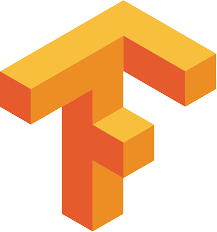
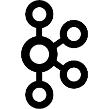

## Hello World 👋, I’m Emna

#### Data science and Development 

- 👋 Hands on Data Science. 

- 👀 I’m interested in <b> Python, Django, Flask, Statistical Modeling, Machine Learning, Natural Language Processing, Deep learning, Graph theory, Data analysis,...</b>

- 🌱 I’m currently learning Cloud computing like <b> AWS and </b> Distributed systems like <b> Databricks </b> and <b> Spark </b> (pySpark and Spark with Java).

- 💞️ I’m looking to collaborate on diverse projects and new ideas

- 📫 How to reach me: <a href = "mailto: emna.debbabii@gmail.com">emna.debbabii@gmail.com</a>

### Connect with me:

### Languages and Tools:

 

